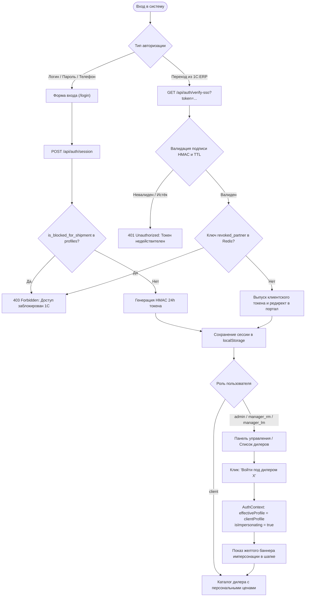
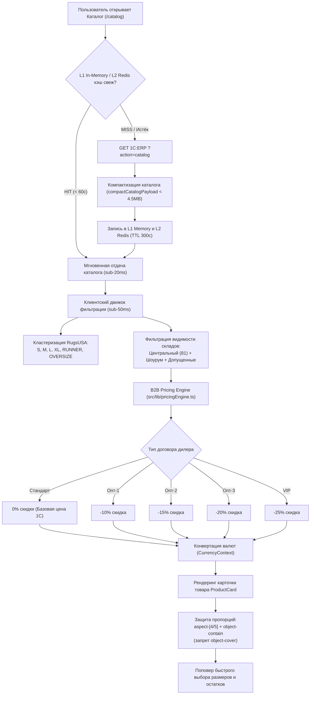
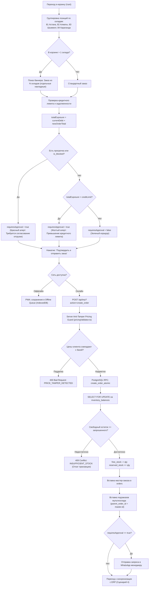
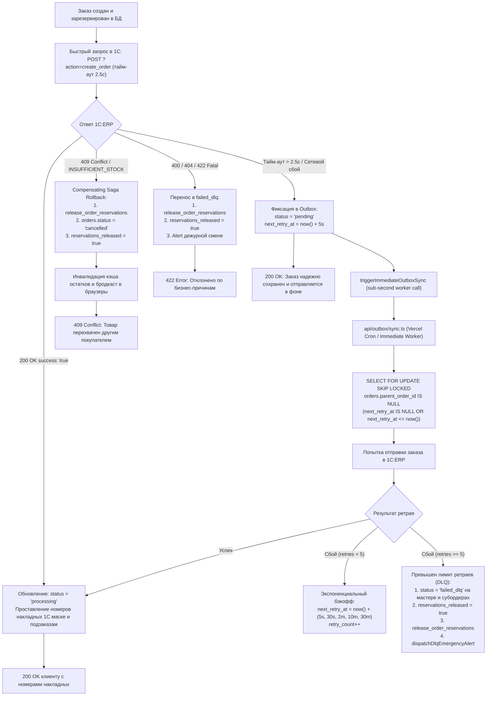
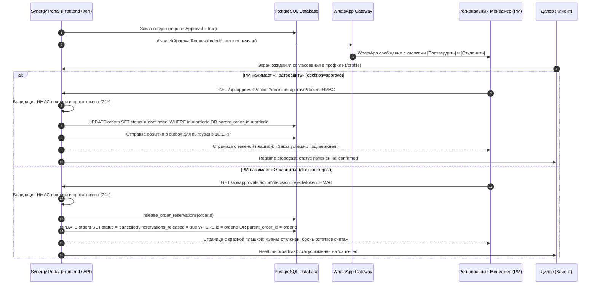
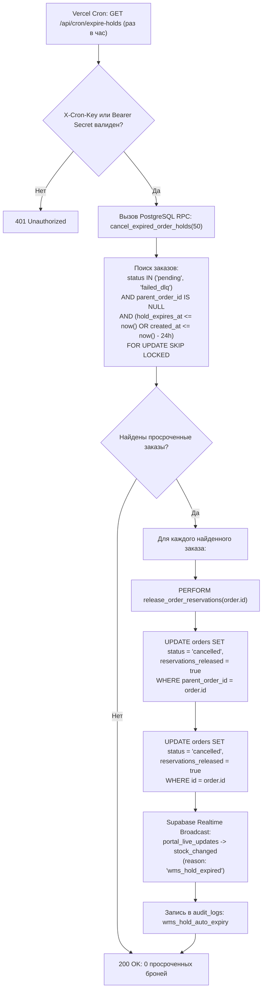
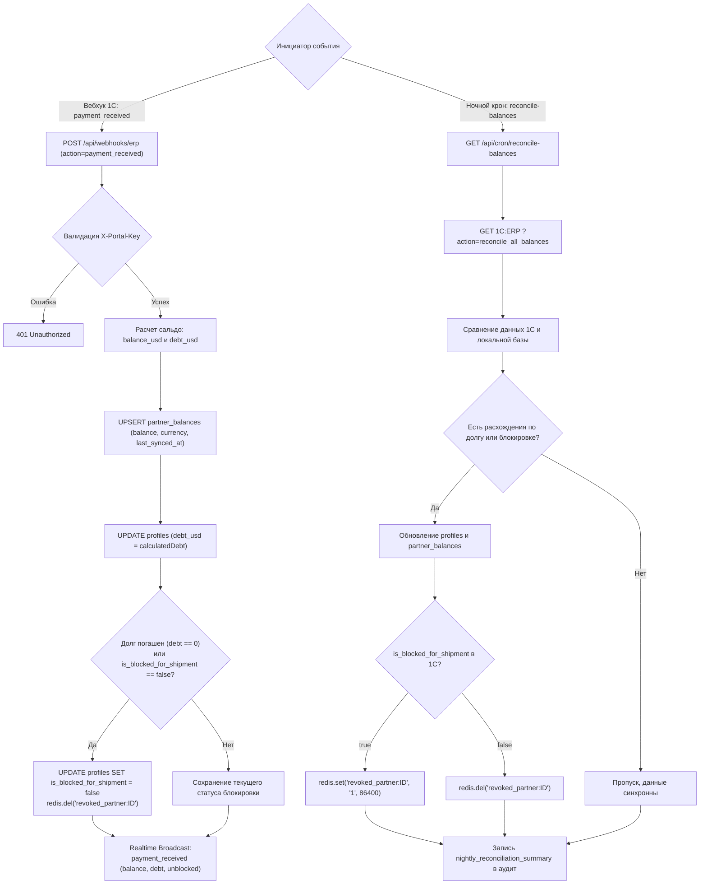
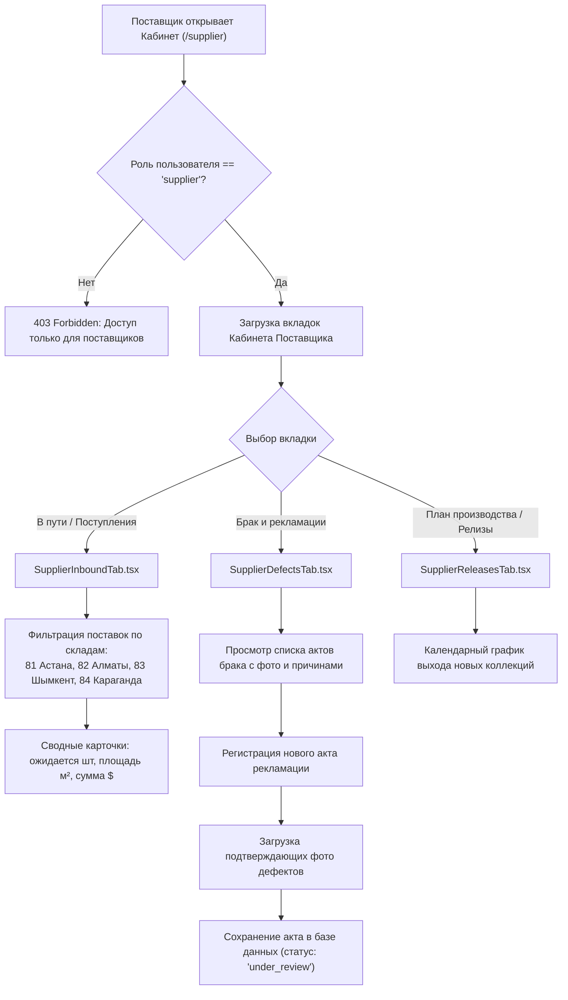
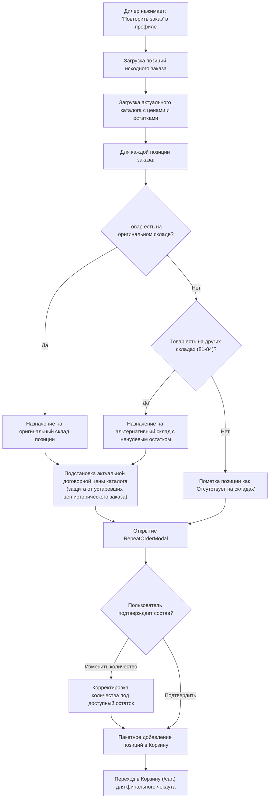

# 🧭 Synergy B2B Portal — Сквозные Бизнес-Процессы и Архитектурные Блок-Схемы

> **Назначение документа**: Данный стандарт содержит детальные сквозные блок-схемы (End-to-End Flowcharts) абсолютно всех бизнес-сценариев платформы «СинЭнергия». Каждый сценарий описывает путь от пользовательского взаимодействия в UI/UX через слой безопасности API и транзакции PostgreSQL/Redis до шлюзов 1С:ERP, очередей Outbox и отказоустойчивых фоллбэков.

---

## Оглавление сценариев

1. [Сценарий 1: Аутентификация, SSO из 1С:ERP и Безопасная Имперсонация](#1-сценарий-1-аутентификация-sso-из-1серр-и-безопасная-имперсонация)
2. [Сценарий 2: Поиск, Каталог, Кластеризация RugsUSA и Расчёт Договорных Цен](#2-сценарий-2-поиск-каталог-кластеризация-rugsusa-и-расчёт-договорных-цен)
3. [Сценарий 3: Корзина, Мультисклад, Валидация Кредитного Плеча и Атомарный Чекаут](#3-сценарий-3-корзина-мультисклад-валидация-кредитного-плеча-и-атомарный-чекаут)
4. [Сценарий 4: Синхронизация с 1С:ERP, Outbox Worker, Saga Rollback и DLQ](#4-сценарий-4-синхронизация-с-1серр-outbox-worker-saga-rollback-и-dlq)
5. [Сценарий 5: Двустороннее Согласование Заказов через WhatsApp](#5-сценарий-5-двустороннее-согласование-заказов-через-whatsapp)
6. [Сценарий 6: Удержание и Автоотмена Просроченных Броней WMS (Hold TTL)](#6-сценарий-6-удержание-и-автоотмена-просроченных-броней-wms-hold-ttl)
7. [Сценарий 7: Финансовая Сверка, Поступление Оплат и Разблокировка Дилеров](#7-сценарий-7-финансовая-сверка-поступление-оплат-и-разблокировка-дилеров)
8. [Сценарий 8: Кабинет Поставщика, Рекламации и Оприходование Поступлений](#8-сценарий-8-кабинет-поставщика-рекламации-и-оприходование-поступлений)
9. [Сценарий 9: Умный Повтор Заказа из Истории с Мультискладским Подбором](#9-сценарий-9-умный-повтор-заказа-из-истории-с-мультискладским-подбором)

---

## 1. Сценарий 1: Аутентификация, SSO из 1С:ERP и Безопасная Имперсонация

### 1.1. Архитектурная блок-схема

### 1.2. Архитектурные инварианты и UI/UX сценарии
1. **Разделение прав при имперсонации**:
   - `effectiveProfile` отображает данные выбранного дилера (цены по его договору, его лимиты, его шоурум).
   - При оформлении заказа `createOrderHandler.ts` передаёт:
     - `user_id = rawPayload.user_id` (дилер);
     - `placed_by_id = callerAuth.userId` (менеджер/админ).
   - В UI шапки отображается плашка: «Вы просматриваете портал от имени [Компания Дилера]» с кнопкой «Вернуться в панель управления».
2. **Мгновенный сессионный отзыв (Zero-Trust)**:
   - При блокировке в 1С вызывается вебхук `client_deactivated`, выставляющий `revoked_partner:${partnerId}` в Redis со сроком 24ч и рассылающий Realtime-событие `client_deactivated`.
   - Клиентский браузер перехватывает событие и немедленно сбрасывает сессию с редиректом на экран логина.

---

## 2. Сценарий 2: Поиск, Каталог, Кластеризация RugsUSA и Расчёт Договорных Цен

### 2.1. Архитектурная блок-схема

### 2.2. Архитектурные инварианты и UI/UX сценарии
1. **Геометрическая целостность (Столп 4)**:
   - Никаких обрезанных ковров: свойство `object-contain` строго обязательно для всех превью и галерей.
   - Размерный ряд отображается через кластеры (S, M, L, XL, Дорожка, Оверсайз).
2. **Realtime-актуализация курсов валют**:
   - `CurrencyContext` слушает событие `currency_rate_updated` из Realtime канала `portal_live_updates`. При изменении курса валют в 1С все ценники пересчитываются моментально без перезагрузки страницы.

---

## 3. Сценарий 3: Корзина, Мультисклад, Валидация Кредитного Плеча и Атомарный Чекаут

### 3.1. Архитектурная блок-схема

### 3.2. Архитектурные инварианты и UI/UX сценарии
1. **Сохранение физического метража при скидках**:
   - `finalTotalSqm` вычисляется строго из `it.area_sqm * it.quantity` (геометрические параметры ковра), а не обратным делением со скидочной цены на базовую стоимость кв.м.
2. **Атомарность транзакции**:
   - Создание мастер-заказа, субордеров мультисклада и блокировка складских остатков выполняются в единой транзакции базы данных. При нехватке хотя бы 1 артикула ни один заказ не сохраняется.

---

## 4. Сценарий 4: Синхронизация с 1С:ERP, Outbox Worker, Saga Rollback и DLQ

### 4.1. Архитектурная блок-схема

### 4.2. Архитектурные инварианты и UI/UX сценарии
1. **Защита от утечки резервов (Zero Reservation Leak)**:
   - При отказе 1С (409 Conflict), при фатальной бизнес-ошибке (4xx) и при переводе в `failed_dlq` процедура компенсирующей транзакции Saga возвращает остатки на баланс склада и проставляет `reservations_released: true`.
2. **Каскад на дочерние подзаказы**:
   - При переводе мастер-заказа в `failed_dlq` все подзаказы мультисклада с `parent_order_id = master.id` каскадно обновляются в статус `failed_dlq`.

---

## 5. Сценарий 5: Двустороннее Согласование Заказов через WhatsApp

### 5.1. Архитектурная блок-схема

### 5.2. Архитектурные инварианты и UI/UX сценарии
1. **Безопасность токена согласования**:
   - Ссылка подтверждения содержит криптографически подписанный токен HMAC SHA-256 (`generateSignedDecisionToken`), привязанный к ID заказа, решению и сроку экспирации (24 часа). Подделать ссылку невозможно.
2. **Мгновенное каскадное обновление**:
   - При подтверждении или отклонении действие затрагивает и мастер-заказ, и все дочерние субордеры мультисклада.

---

## 6. Сценарий 6: Удержание и Автоотмена Просроченных Броней WMS (Hold TTL)

### 6.1. Архитектурная блок-схема

### 6.2. Архитектурные инварианты и UI/UX сценарии
1. **Конкурентная изоляция (`SKIP LOCKED`)**:
   - Если параллельно работает другой воркер или заказ редактируется менеджером, `FOR UPDATE SKIP LOCKED` пропускает заблокированные строки, предотвращая взаимные блокировки (deadlocks).
2. **Realtime-возврат на витрину**:
   - Как только бронь снимается, событие транслируется во все открытые вкладки дилеров, возвращая товар в статус «В наличии».

---

## 7. Сценарий 7: Финансовая Сверка, Поступление Оплат и Разблокировка Дилеров

### 7.1. Архитектурная блок-схема

### 7.2. Архитектурные инварианты и UI/UX сценарии
1. **Исключение Deadlock сессий**:
   - При погашении задолженности клиент разблокируется одновременно в Postgres и Redis, что мгновенно снимает ограничение на оформление заказов без необходимости ожидания истечения 24-часового TTL сессии.
2. **Мгновенное обновление шапки дилера**:
   - Событие `payment_received` через Realtime обновляет финансовую плашку в шапке портала: баланс пересчитывается, статус блокировки снимается.

---

## 8. Сценарий 8: Кабинет Поставщика, Рекламации и Оприходование Поступлений

### 8.1. Архитектурная блок-схема

### 8.2. Архитектурные инварианты и UI/UX сценарии
1. **Региональное разделение поставок**:
   - Поставки строго разделяются по региональным складам (81 Астана, 82 Алматы, 83 Шымкент, 84 Караганда), исключая смешение остатков между филиалами.
2. **Прозрачность рекламаций**:
   - Любой зафиксированный брак привязывается к партии и артикулу с возможностью прикрепления фотографий дефектов рулона.

---

## 9. Сценарий 9: Умный Повтор Заказа из Истории с Мультискладским Подбором

### 9.1. Архитектурная блок-схема

### 9.2. Архитектурные инварианты и UI/UX сценарии
1. **Защита от устаревших цен**:
   - При повторе заказа исторические цены никогда не подставляются вслепую: они сверяются с актуальным каталогом и договором дилера.
2. **Мультискладская гибкость**:
   - Если позиция ранее заказывалась из Алматы (82), но сейчас доступна только в Астане (81), система автоматически предлагает альтернативный склад с предупреждением в модальном окне.

---

## 10. Матрица UI/UX Состояний и Точек Отказа (Error & Edge Case Matrix)

| Бизнес-процесс | Нормальное состояние (Happy Path) | Точка отказа / Ошибка | Реакция системы (System Behavior) | Отображение в UI/UX |
| :--- | :--- | :--- | :--- | :--- |
| **Оформление заказа** | 200 OK, номер накладной присвоен | Разрыв связи с 1С:ERP | Сохранение в Outbox, запуск фонового воркера | Зеленый баннер: «Заказ принят и надежно сохранен. Синхронизация выполняется в фоне» |
| **Оформление заказа** | Свободного остатка достаточно | 409 Conflict: перехват остатка другим дилером | Compensating Saga: откат резервов, статус `cancelled`, `reservations_released: true` | Красный баннер с точным указанием артикула и фактически доступного остатка |
| **Кредитный контроль** | Долг в пределах лимита | Превышение кредитного лимита или просрочка | Выставление `requiresApproval = true`, отправка в WhatsApp РМ | Желтый/красный информационный блок: «Заказ передан вашему менеджеру на согласование в WhatsApp» |
| **Курс валют** | Курс 520 KZT/USD | Изменение курса в 1С до 530 KZT/USD | Вебхук `currency_rate_updated` транслирует изменение через Realtime | Цены в тенге пересчитываются моментально во всех открытых вкладках без F5 |
| **Имперсонация** | Просмотр каталога под дилером | Оформление заказа менеджером от имени клиента | `user_id = client.id`, `placed_by_id = manager.id` | Желтая плашка в шапке; дилер видит оформленный заказ в своем личном кабинете |
| **Сессия клиента** | Активная работа в портале | Деактивация клиента в 1С:ERP | Вебхук `client_deactivated` вносит партнёра в Redis Blacklist и шлет broadcast | Немедленный логаут с выводом сообщения: «Учетная запись деактивирована администратором» |
| **Разблокировка** | Клиент был заблокирован за долг | Поступление оплаты и погашение задолженности | Вебхук `payment_received` удаляет ключ из Redis и обновляет `is_blocked = false` | Мгновенная разблокировка кнопки чекаута в корзине дилера |
