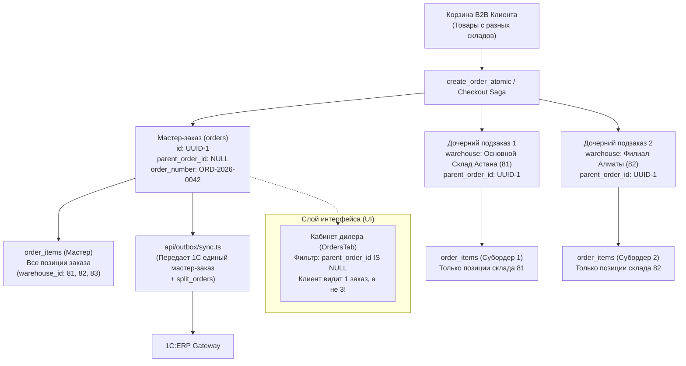
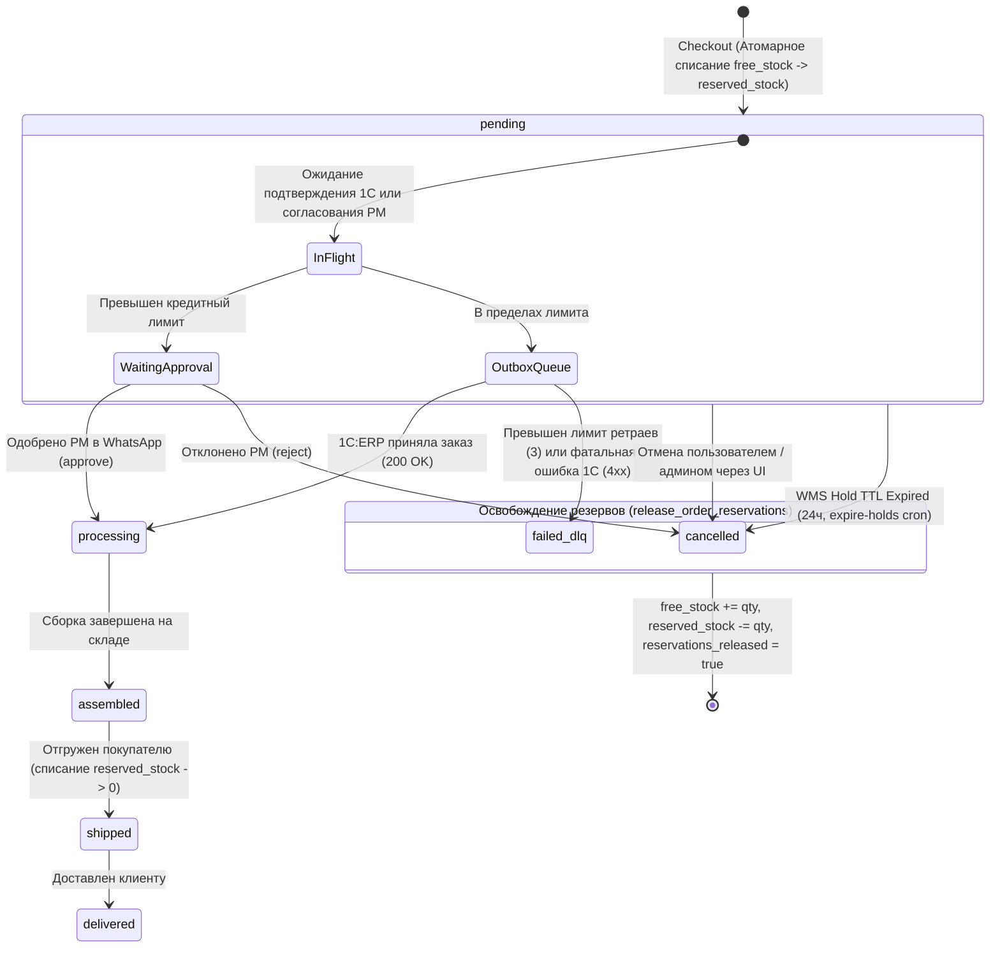
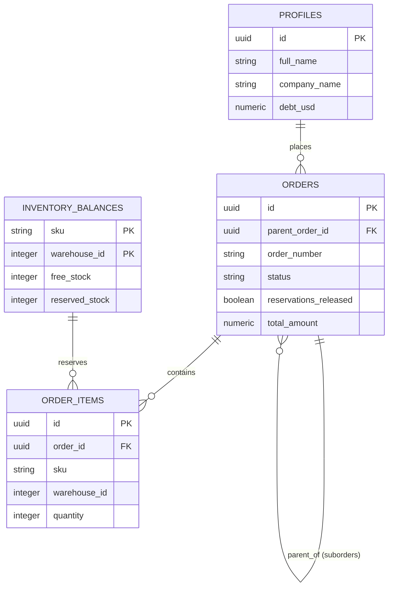

# Synergy B2B Portal — Стандарт жизненного цикла заказов и складских резервов

> **Статус:** Обязательный архитектурный стандарт (P0 Invariant)  
> **Область действия:** Чекаут, Мультисклад, Интеграция 1С:ERP, WMS Бронирование, Отмена и DLQ  
> **Последнее обновление:** 2026-09-30 (Stage 8)

---

## 1. Фундаментальные инварианты (Core Architectural Invariants)

1. **Zero Reservation Leak Invariant (Защита от утечек и раздувания остатков):**
   - При создании любого заказа свободный остаток `free_stock` списывается, а `reserved_stock` пропорционально увеличивается атомарно в PostgreSQL (`create_order_atomic`).
   - При любой отмене заказа (`cancelled`), сбое в DLQ (`failed_dlq`) или истечении TTL брони (24ч), резерв обязан быть возвращен обратно в `free_stock` **ровно один раз**.
   - Повторный вызов отмены или освобождения брони обязан быть строго идемпотентным (флаг `orders.reservations_released = true`).

2. **Master Order Monolith & Suborder Encapsulation (Изоляция подзаказов):**
   - Клиент оформляет единую корзину. В БД создается один **Мастер-заказ** (`parent_order_id IS NULL`), содержащий полный список позиций в `order_items`.
   - Если товары заказа лежат на разных складах (мультисклад), создаются **дочерние субордеры** (`parent_order_id = master.id`).
   - **Правило отображения в UI:** Клиент в личном кабинете видит **только мастер-заказы** (`.is('parent_order_id', null)`). Подзаказы клиенту отдельно не показываются, чтобы исключить задвоение сумм и количества позиций.
   - **Правило синхронизации с 1С:** В Outbox и в 1C:ERP отправляется **только мастер-заказ** с вложенным массивом `split_orders`.

3. **Strict Schema & Relational Separation (Запрет нереляционных псевдо-колонок):**
   - Таблица `orders` **не содержит** колонок `items`, `client_name`, `client_company`, `client_phone`.
   - Товарные позиции хранятся **строго** в связанной таблице `order_items(order_id)`.
   - Профиль клиента хранится **строго** в `profiles(user_id)`.
   - Номер заказа хранится в колонке `order_number` (не `doc_number`).
   - Название склада хранится в колонке `warehouse` (не `warehouse_name`).

---

## 2. Иерархия мастер-заказа и мультискладских подзаказов



---

## 3. Конечный автомат состояний (Order & Stock FSM)



---

## 4. Матрица ответственности и правил отмены

| Инициатор отмены | Точка входа | Действие со складом | Каскад на субордеры |
| :--- | :--- | :--- | :--- |
| **Пользователь из списка заказов** | `useOrdersList.ts -> handleCancelOrder` | `rpc('release_order_reservations')` | `UPDATE orders SET status='cancelled' WHERE id=X OR parent_order_id=X` |
| **Пользователь из детальной карточки** | `OrderDetail.tsx -> handleStatusChange` | `rpc('release_order_reservations')` | `UPDATE orders SET status='cancelled' WHERE id=X OR parent_order_id=X` |
| **Менеджер через WhatsApp** | `api/approvals/action.ts?decision=reject` | `rpc('release_order_reservations')` | Каскадный `UPDATE status='cancelled'` для `parent_order_id=X` |
| **Фоновый крон истечения срока (TTL)** | `api/cron/expire-holds.ts` | `cancel_expired_order_holds()` | Изоляция мастера + каскад `status='cancelled'` на подзаказы |
| **Сбой очереди синхронизации (DLQ)** | `api/outbox/sync.ts` | `rpc('release_order_reservations')` | Каскадный `UPDATE status='failed_dlq'` для `parent_order_id=X` |
| **Вебхук статуса от 1С:ERP** | `orderStatusHandler.ts` (`status: cancelled`) | `rpc('release_order_reservations')` | Каскадный `UPDATE status='cancelled'` для `parent_order_id=X` |

---

## 5. Словарь сущностей базы данных (Database Entity Mapping)



| Сущность | Таблица PostgreSQL | Обязательные правила обращения |
| :--- | :--- | :--- |
| **Мастер-заказ** | `orders` | Колонка `parent_order_id IS NULL`. Номер: `order_number`. Склад: `warehouse`. Суммы: `total_amount`, `total_sqm`, `total_items`. |
| **Субордер склада** | `orders` | Колонка `parent_order_id = master.id`. Не включать в выдачу клиентского списка заказов! |
| **Позиции заказа** | `order_items` | Связь `order_id -> orders.id`. Содержит `sku`, `warehouse_id`, `warehouse`, `size`, `price`, `quantity`. |
| **Остатки склада** | `inventory_balances` | Составной ключ `(sku, warehouse_id)`. Колонки: `free_stock`, `reserved_stock`, `total_stock`. |
| **Профиль клиента** | `profiles` | Связь `orders.user_id -> profiles.id`. Содержит `full_name`, `company_name`, `phone`, `debt_usd`, `credit_limit_usd`. |

---

## 6. Чеклист для разработчиков и AI-агентов (Definition of Done)

Перед внесением любых изменений в модули чекаута, корзины, заказов или синхронизации:

- [ ] В любых выборках заказов для клиента (`useOrdersList`, `activeReservationsHandler` и др.) обязательно присутствует `.is('parent_order_id', null)`.
- [ ] При отмене заказа всегда вызывается процедура `release_order_reservations` ровно **один раз** для мастер-заказа.
- [ ] При обновлении статуса мастер-заказа статус каскадно обновляется для `parent_order_id = master.id`.
- [ ] Запрещено обращаться к несуществующим колонкам `orders.items`, `orders.client_name`, `orders.doc_number`.
- [ ] Пройдены все проверки пайплайна:
  ```bash
  python3 scripts/test_resilience_and_security.py && python3 scripts/check-ui-standards.py && python3 scripts/check-modularity-standards.py
  ```
