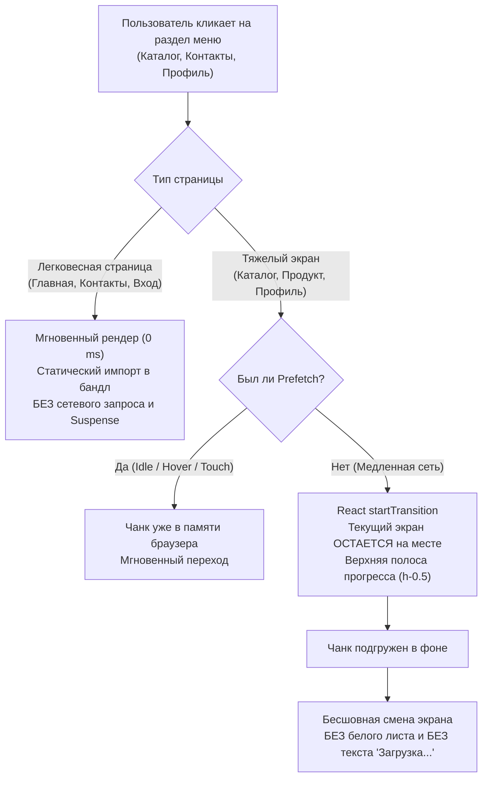

# ⚡ Page Transitions, Code Splitting & Zero-Flicker Loading Standards

> **Версия стандарта:** 1.0.0  
> **Область действия:** `src/App.tsx`, `src/pages/*`, `src/components/Header.tsx`, `src/components/MobileNav.tsx`, React Suspense & Routing Architecture.  
> **Статус:** Обязательный стандарт (P0 Hard Invariant).

---

## 1. Контекст проблемы и предпосылки

Исторически в SPA-приложениях при наивной настройке `React.lazy` и `Suspense` возникает проблема **«двухэтапного мерцания» (Two-Stage Flicker / White Void)**:

1. **Синхронное размонтирование (Layout Drop):** При клике на ссылку в меню навигации (`setPage(target)`) React синхронно удаляет текущий экран.
2. **Экран-пустышка:** Если чанк следующей страницы ещё не загружен по сети, `<Suspense>` рендерит fallback — пустой белый лист со спиннером или текстовую надпись вида `«Загрузка раздела...»`.
3. **Второй скачок (Skeleton Jump):** Когда JS-файл скачивается и страница наконец монтируется, она включает собственный скелетон загрузки данных из API, сменяя спиннер на серые карточки.
4. **Итоговый рендер:** По приходу данных из API серые карточки сменяются реальным контентом.

Для B2B-клиентов и менеджеров оптового портала такой интерфейс выглядит дерганым, зависшим и ненадежным.

---

## 2. Архитектурная блок-схема (Mermaid)



---

## 3. Red Lines (Строго запрещено)

> [!CAUTION]
> Любой PR или коммит, нарушающий хотя бы одно из правил ниже, блокируется CI-проверками:

1. ❌ **Запрет текстовых заглушек загрузки:**  
   Строго запрещено выводить в интерфейсе текст `«Загрузка раздела...»`, `«Подождите...»` или пустые белые экраны между шапкой и подвалом.
2. ❌ **Запрет синхронного размонтирования экранов:**  
   Строго запрещено вызывать `setPage(target)` напрямую для лениво загружаемых страниц. Переходы обязаны быть обернуты в `React.startTransition`.
3. ❌ **Запрет `React.lazy` для легковесных экранов (< 300 строк):**  
   Легковесные экраны без тяжелых зависимостей (`HomePage`, `ContactsPage`, `LoginPage`) обязаны импортироваться напрямую (статически).
4. ❌ **Запрет несовпадающих по геометрии скелетонов:**  
   Скелетон загрузки (`PageLoadingFallback`) обязан точно повторять контейнер (`container-w`), отступы и сетку колонок целевого экрана, исключая сдвиг макета (Cumulative Layout Shift, CLS).

---

## 4. Обязательные технические паттерны

### 4.1. Бесшовная навигация через `React.useTransition`

В `src/App.tsx` смена активного экрана производится исключительно через concurrent transition:

```tsx
// src/App.tsx
const [isPending, startTransition] = useTransition();

const navigate = useCallback((target: PageId, id?: string, pushToHistory = true) => {
  // Concurrent переключение: текущий экран не размонтируется до готовности нового
  startTransition(() => {
    setPage(target);
    if (target === 'catalog' && id?.startsWith('country:')) {
      setCatalogCountry(id.slice('country:'.length));
      setCatalogCollection(undefined);
    } else if (target === 'catalog' && id) {
      setCatalogCollection(id);
      setCatalogCountry(undefined);
    } else if (target === 'catalog') {
      setCatalogCollection(undefined);
      setCatalogCountry(undefined);
    }
    if (id && target === 'product') setProductId(id);
  });

  if (pushToHistory) {
    // Обновление URL в истории браузера
    ...
  }

  window.scrollTo({ top: 0, behavior: 'auto' });
}, []);
```

### 4.2. Ненавязчивая полоса прогресса (Top Progress Bar)

Вместо блокирующего спиннера на весь экран при медленной сети сверху отображается деликатная 2px анимированная полоса:

```tsx
{isPending && (
  <div className="fixed top-0 left-0 right-0 z-[99999] h-0.5 bg-gradient-to-r from-brand-600 via-amber-500 to-brand-700 animate-pulse pointer-events-none" />
)}
```

### 4.3. Трехуровневый Prefetching (Предзагрузка чанков)

1. **Idle Prefetching:** При загрузке приложения в моменты простоя браузера (`requestIdleCallback`) чанк каталога подгружается в фоновом режиме:
   ```tsx
   useEffect(() => {
     const prefetch = () => { import('@/pages/CatalogPage'); };
     if (typeof window !== 'undefined') {
       if ('requestIdleCallback' in window) {
         (window as any).requestIdleCallback(prefetch, { timeout: 2500 });
       } else {
         const timer = setTimeout(prefetch, 1200);
         return () => clearTimeout(timer);
       }
     }
   }, []);
   ```
2. **Hover Prefetching:** При наведении курсора мыши на ссылку «Каталог» в шапке (`onMouseEnter`):
   ```tsx
   onMouseEnter={() => { if (page === 'catalog') import('@/pages/CatalogPage'); }}
   ```
3. **Touch Prefetching:** При первом касании пальцем на мобильных экранах (`onTouchStart`):
   ```tsx
   onTouchStart={() => { if (page === 'catalog') import('@/pages/CatalogPage'); }}
   ```

### 4.4. Контекстно-ориентированный скелетон (Context-Aware Fallback)

Если пользователь впервые заходит по прямой внешней ссылке (холодный старт без кэша), `PageLoadingFallback` отображает скелетон, соответствующий типу запрашиваемой страницы:

```tsx
function PageLoadingFallback({ page }: { page?: PageId }) {
  if (page === 'catalog') {
    return (
      <section className="min-h-screen bg-slate-50 pt-20 pb-24 lg:pb-8">
        <div className="container-w">
          <div className="mb-8 space-y-3">
            <div className="skeleton h-8 w-64" />
            <div className="skeleton h-4 w-96 max-w-full" />
          </div>
          <div className="mb-6 flex gap-3">
            <div className="skeleton h-11 w-28" />
            <div className="skeleton h-11 w-40" />
          </div>
          <div className="grid grid-cols-2 md:grid-cols-3 lg:grid-cols-4 gap-4 lg:gap-6">
            {Array.from({ length: 8 }).map((_, i) => (
              <div key={i} className="card overflow-hidden">
                <div className="skeleton aspect-[4/3] rounded-none" />
                <div className="p-3 sm:p-4 space-y-2">
                  <div className="skeleton h-3 w-full" />
                  <div className="skeleton h-3 w-2/3" />
                  <div className="skeleton h-4 w-20 mt-2" />
                </div>
              </div>
            ))}
          </div>
        </div>
      </section>
    );
  }

  return (
    <section className="min-h-screen bg-slate-50 pt-20 pb-24 lg:pb-8">
      <div className="container-w py-8">
        <div className="mb-8 space-y-3">
          <div className="skeleton h-8 w-48" />
          <div className="skeleton h-4 w-80 max-w-full" />
        </div>
        <div className="card p-6 md:p-8 space-y-4">
          <div className="skeleton h-6 w-1/3" />
          <div className="skeleton h-4 w-full" />
          <div className="skeleton h-4 w-3/4" />
        </div>
      </div>
    </section>
  );
}
```

### 4.5. Защита от устаревших чанков при деплое (`lazyWithRetry`)

При каждом деплое на Vercel хэши чанков меняются. Если пользователь находился на портале во время релиза, браузер может запросить удалённый старый чанк. Обертка `lazyWithRetry` обязана перехватывать сетевую ошибку чанка и перезагружать страницу ровно 1 раз через ключ сессии:

```tsx
function lazyWithRetry<T extends React.ComponentType<any>>(
  factory: () => Promise<{ default: T }>
) {
  return lazy(async () => {
    try {
      return await factory();
    } catch (err: any) {
      const msg = String(err?.message || '');
      if (
        msg.includes('Failed to fetch dynamically imported module') ||
        msg.includes('Importing a module script failed') ||
        msg.includes('Expected a JavaScript-or-Wasm module script')
      ) {
        const retryKey = 'chunk_reload_' + (typeof window !== 'undefined' ? window.location.pathname : '');
        if (typeof window !== 'undefined' && !sessionStorage.getItem(retryKey)) {
          sessionStorage.setItem(retryKey, '1');
          window.location.reload();
          return new Promise(() => {}) as any;
        }
      }
      throw err;
    }
  });
}
```

---

## 5. Чеклист для Code Review и Добавления Новых Страниц

При создании новой страницы в `src/pages/`:

- [ ] **Оценка размера:** Если страница легковесная (< 300 строк, нет тяжелых библиотек), импортируйте её в `App.tsx` **напрямую**.
- [ ] **Если страница тяжелая:** Оборачивайте в `lazyWithRetry(() => import('@/pages/MyNewPage'))`.
- [ ] **Prefetch:** Если пункт меню часто посещается, добавьте `onMouseEnter` / `onTouchStart` prefetch в `Header.tsx` и `MobileNav.tsx`.
- [ ] **Zero Text Loading:** Убедитесь, что в коде компонента нет нестилизованных текстовых заглушек вида `<div>Загрузка...</div>` — используйте только `skeleton`.
- [ ] **Тестирование медленной сети:** Проверьте переключение на Fast 3G / Slow 3G в DevTools — экран не должен схлопываться в белый лист.
